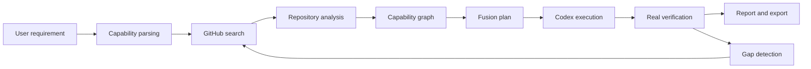

# Kakashi

Language: [简体中文](README.md) | English

[](https://github.com/eust-w/kakashi/actions/workflows/ci.yml)
[](https://github.com/eust-w/kakashi/releases)
[](LICENSE)
[](https://nodejs.org/)

Kakashi is a Codex CLI / Codex Desktop orchestration layer for GitHub multi-repository capability search, fusion, code modification, and verification.

Describe the software you want in one sentence. Kakashi searches real GitHub repositories, analyzes capabilities and licenses, selects a main project plus auxiliary sources, creates a fusion plan, asks Codex CLI to modify code, runs real verification, and exports a runnable project with a complete process report.

[Highlights](#highlights) · [Quickstart](#quickstart) · [Configuration](#configuration) · [CLI](#cli) · [Web UI](#web-ui) · [Release](https://github.com/eust-w/kakashi/releases) · [Contributing](#contributing)

## Highlights

- Real GitHub search: searches public or authorized repositories through Octokit, with `gh api` fallback for transient network failures.
- Explainable repository selection: candidates carry score breakdowns and selection reasons, and the final report explains why sources were chosen.
- Real Codex modification: runs local `codex exec` instead of simulated success paths.
- Real verification loop: runs install, lint, build, test, CLI help, or server readiness checks; when server output exposes a local URL, Kakashi performs a real HTTP probe and falls back to common health endpoints.
- Cancellable execution: CLI/Web background commands accept cancellation and terminate git, Codex, and verifier subprocesses.
- Local Web UI: supports auto/interactive modes, candidate repository selection, fusion-plan rebuilds, repair iterations, copyleft policy, overwrite behavior, and run cancellation.
- Provenance and license tracking: exports `SOURCE_PROVENANCE.json`, `KAKASHI_REPORT.md`, and copied source license files.

## Why Kakashi

Many code generation tools start from an empty folder or a single template. Kakashi has a different goal: it treats GitHub as the source of open-source capabilities, Codex as the code execution engine, and multiple repositories as composable inputs for a new runnable project.

- It does not fork Codex CLI; it orchestrates Codex CLI / Desktop for code changes.
- It does not mock GitHub, Codex, or verification results; the default path uses real search, cloning, and command execution.
- It does not hardcode success paths; failed verification can enter repair loops and remains visible in the report.
- It outputs code plus provenance, copied licenses, verification logs, and final process documentation.



## Core Capabilities

- Requirement Parser: converts natural language into target, stack, constraints, and capability nodes.
- GitHub Searcher: searches real GitHub repositories through Octokit, `gh`, or token authentication.
- Repo Analyzer: clones repositories and analyzes manifests, commands, README evidence, modules, stacks, and licenses.
- Capability Graph: maps which repositories provide which capabilities.
- Fusion Planner: selects the main project and auxiliary projects, then creates a fusion plan.
- Codex Executor: calls local `codex exec` for real code changes.
- Gap Detector: reads verifier failures, identifies missing capabilities, and searches GitHub again.
- Verifier: detects and runs install, build, test, lint, start, and similar commands; server readiness validates HTTP 2xx/3xx responses when a local URL is available, including `/health`, `/api/health`, `/ready`, and `/readiness` fallbacks.
- Exporter: writes the new project, README, run commands, verification report, and provenance.

## Quickstart

Make sure Git, GitHub CLI, and Codex CLI are available:

```bash
git --version
gh auth status
codex login status
```

Download the single-file executable for your system:

- `kakashi-v0.2.0-linux-x64`
- `kakashi-v0.2.0-linux-arm64`
- `kakashi-v0.2.0-darwin-x64`
- `kakashi-v0.2.0-darwin-arm64`
- `kakashi-v0.2.0-windows-x64.exe`
- `kakashi-v0.2.0-windows-arm64.exe`

Linux/macOS:

```bash
chmod +x kakashi-v0.2.0-darwin-arm64
./kakashi-v0.2.0-darwin-arm64 doctor
./kakashi-v0.2.0-darwin-arm64 run \
  "Build a TypeScript CLI with tests" \
  --out ./generated \
  --max-repos 8 \
  --max-iterations 2 \
  --force
```

Windows PowerShell:

```powershell
.\kakashi-v0.2.0-windows-x64.exe doctor
.\kakashi-v0.2.0-windows-x64.exe run `
  "Build a TypeScript CLI with tests" `
  --out .\generated `
  --max-repos 8 `
  --max-iterations 2 `
  --force
```

Every completed run writes:

- `KAKASHI_REPORT.md`: full process report.
- `SOURCE_PROVENANCE.json`: source repositories, capability matches, and source references.
- `.kakashi/run-report.json`: machine-readable run record.
- `.kakashi/licenses/`: copied source repository licenses.

## Configuration

Kakashi does not have a separate Kakashi API key. It needs two external authentication paths:

- GitHub authentication, used to search, inspect, and clone GitHub repositories.
- Codex authentication, used to run `codex exec` for code changes and repair loops.

### GitHub

The recommended path is GitHub CLI login:

```bash
gh auth login
gh auth status
```

For CI, servers, or non-interactive environments, use an environment variable:

```bash
export GH_TOKEN="github_pat_xxx"
# or
export GITHUB_TOKEN="github_pat_xxx"
```

Kakashi resolves GitHub authentication in this order:

1. `GITHUB_TOKEN`
2. `GH_TOKEN`
3. `gh auth token`

For public repositories, a normal GitHub CLI login is usually enough. For private repositories, make sure the token or logged-in GitHub account has access to those repositories.

### Codex

Kakashi calls the local `codex exec` command, so Codex CLI must work independently before Kakashi can execute real code changes.

Use browser or device login:

```bash
codex login
codex login status
```

Use an OpenAI API key:

```bash
export OPENAI_API_KEY="sk-..."
printenv OPENAI_API_KEY | codex login --with-api-key
codex login status
```

Use a Codex access token:

```bash
export CODEX_ACCESS_TOKEN="..."
printenv CODEX_ACCESS_TOKEN | codex login --with-access-token
codex login status
```

Do not commit API keys, GitHub tokens, or access tokens to source code, README files, issues, logs, or generated projects. Use a system credential manager, CI secrets, shell session environment variables, or the credential storage managed by `gh auth login` / `codex login`.

### Verify Configuration

```bash
kakashi doctor
```

If you use the single-file executable:

```bash
./kakashi-v0.2.0-darwin-arm64 doctor
```

If you run from source:

```bash
pnpm kakashi doctor
```

Expected successful checks include:

- `PASS git`
- `PASS gh`
- `PASS codex`
- `PASS github-auth`
- `PASS codex-version`
- `PASS gh-version`
- `PASS git-version`

## CLI

Full auto mode:

```bash
kakashi run \
  "Build a TypeScript web dashboard with GitHub search, capability graph, and live Codex execution logs" \
  --out ./generated-dashboard \
  --max-repos 12 \
  --max-iterations 3
```

Interactive mode:

```bash
kakashi interactive \
  "Build a local-first project management app with Kanban, calendar, and export" \
  --out ./generated-project
```

Inspect a previous run:

```bash
kakashi runs
kakashi inspect <runId>
kakashi events <runId>
```

Machine-readable output is available for CI, scripts, and external orchestrators:

```bash
kakashi run "Build a local analytics CLI" --out ./generated-cli --json
kakashi doctor --json
kakashi runs --json --limit 5
kakashi inspect <runId>
kakashi events <runId> --json
```

`inspect` prints JSON by default; missing run records also write structured errors to stderr.

Common options:

- `--out <dir>`: output directory.
- `--max-repos <n>`: maximum number of candidate repositories to analyze.
- `--max-iterations <n>`: repair-loop attempts after verification failures.
- `--model <name>`: Codex model name.
- `--allow-copyleft`: allow copyleft-licensed repositories as candidates.
- `--force`: allow overwriting the output directory.
- `--json`: print clean JSON for supported commands without progress logs on stdout.

`--max-repos`, `--max-iterations`, and `--limit` must be positive integers. With `--json`, successful payloads are written to stdout; option errors and missing-run errors are written to stderr as `{ "error": "..." }`, so scripts can separate successful output from failure diagnostics.
`--out` must not point at the current workspace or one of its parent directories; even with `--force`, Kakashi will not clear the current project directory.

## Web UI

The single-file executable embeds the Web UI:

```bash
./kakashi-v0.2.0-darwin-arm64 serve --port 4317
```

Open `http://127.0.0.1:4317/`.

`serve --port` must be an integer from `1` to `65535`; invalid ports fail before the server starts.

From source, start the API server:

```bash
pnpm --filter @kakashi/server dev
```

Start the Vite UI:

```bash
pnpm --filter @kakashi/web dev
```

Open `http://127.0.0.1:5173/`.

For a production-style local Web UI after `pnpm build`, serve the built Web app through the CLI:

```bash
pnpm kakashi serve --web-dir apps/web/dist --port 4317
```

Open `http://127.0.0.1:4317/`.

The Web UI does not have a separate API key configuration. It uses the same environment and PATH as the Kakashi server process. The Web UI can configure run mode, candidate repository count, repair iterations, copyleft policy, overwrite behavior, and cancellation for active runs. When an interactive run reaches confirmation, you can select which candidate repositories may participate, click `Update plan` to rebuild the capability graph and fusion plan from analyzed repositories, and then execute the displayed plan. In the same terminal, verify:

```bash
gh auth status
codex login status
kakashi doctor
```

The Web UI restricts output directories to the server work directory. Use relative paths such as `kakashi-output` or `generated/my-app`, and do not set the output directory to the server work directory itself.

## Open Source Status

Kakashi is open source under the MIT License. The main repository is [eust-w/kakashi](https://github.com/eust-w/kakashi). CI runs lint, typecheck, coverage tests, build, and Web e2e. Real GitHub/Codex integration tests require local authentication and are intended for release checks or core workflow changes.

## Source Setup

Source development requires Node.js 24+ and pnpm 10+.

```bash
pnpm install
pnpm build
pnpm run doctor
```

Source CLI commands:

```bash
pnpm kakashi run "Build a TypeScript CLI with tests" --out ./generated --force
pnpm kakashi interactive "Build a local-first notes app" --out ./generated-notes
pnpm kakashi serve --web-dir apps/web/dist --port 4317
```

## Release Assets

Prefer the single-file executable. It bundles the Node.js runtime needed to start Kakashi, although generated projects may still need their own language runtimes and package managers during verification.

Release also includes full archive packages for users who prefer a directory-style install with wrapper scripts, install documentation, and Web UI files:

- `kakashi-v0.2.0-linux-x64.tar.gz`
- `kakashi-v0.2.0-linux-arm64.tar.gz`
- `kakashi-v0.2.0-darwin-x64.tar.gz`
- `kakashi-v0.2.0-darwin-arm64.tar.gz`
- `kakashi-v0.2.0-windows-x64.tar.gz`
- `kakashi-v0.2.0-windows-arm64.tar.gz`

Verify downloads with the release `SHA256SUMS.txt` file.

Archive example:

```bash
tar -xzf kakashi-v0.2.0-linux-x64.tar.gz
cd kakashi-v0.2.0-linux-x64
./bin/kakashi doctor
./bin/kakashi run "Build a TypeScript CLI with tests" --out ./generated --max-repos 8 --max-iterations 2 --force
```

Windows PowerShell:

```powershell
tar -xzf kakashi-v0.2.0-windows-x64.tar.gz
cd kakashi-v0.2.0-windows-x64
.\bin\kakashi.cmd doctor
.\bin\kakashi.cmd run "Build a TypeScript CLI with tests" --out .\generated --max-repos 8 --max-iterations 2 --force
```

## License Policy

By default Kakashi only uses repositories with declared permissive SPDX licenses: MIT, Apache-2.0, BSD, ISC, or 0BSD. Pass `--allow-copyleft` to include common copyleft licenses. Repositories without a declared license are excluded by default.

Generated projects include copied source licenses and record source repositories, capability matches, and usage boundaries in `SOURCE_PROVENANCE.json` and `KAKASHI_REPORT.md`. You should still perform a final license review for your own release model.

## Verification

Local checks:

```bash
pnpm lint
pnpm audit:high
pnpm typecheck
pnpm test:coverage
pnpm build
pnpm test:e2e
pnpm release:package
```

Real integration checks:

```bash
RUN_REAL_INTEGRATION=1 pnpm test:integration
RUN_CODEX_INTEGRATION=1 pnpm test:codex
```

The integration checks use real GitHub/Codex commands. They require network access and valid local authentication.

## Contributing

Issues and pull requests are welcome. Recommended flow:

1. Fork the repository and create a feature branch.
2. Run `pnpm install`.
3. Change code or documentation.
4. Run `pnpm lint && pnpm typecheck && pnpm test:coverage && pnpm build`.
5. Open a pull request and mention whether real GitHub/Codex integration tests were run.

See [CONTRIBUTING.md](CONTRIBUTING.md) for details. See [CODE_OF_CONDUCT.md](CODE_OF_CONDUCT.md) for conduct expectations, [SUPPORT.md](SUPPORT.md) for support boundaries, and [SECURITY.md](SECURITY.md) for security reporting guidance. Use the templates under `.github/` for bugs, feature requests, and pull requests.

## License

Kakashi is released under the [MIT License](LICENSE).
