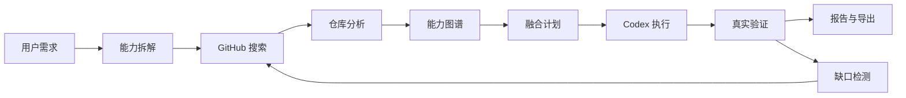

# Kakashi

语言 / Language: 简体中文 | [English](README-en.md)

[](https://github.com/eust-w/kakashi/actions/workflows/ci.yml)
[](https://github.com/eust-w/kakashi/releases)
[](LICENSE)
[](https://nodejs.org/)

Kakashi（复制忍者）是在 Codex CLI / Codex Desktop 之上构建的 GitHub 多仓库能力搜索、融合、改造和验证系统。

你用一句话描述想做的软件，Kakashi 会搜索真实 GitHub 仓库，分析它们的能力和许可证，选择主项目与辅助项目，生成融合计划，调用 Codex CLI 修改代码，跑真实验证，并输出一个可运行项目和完整流程报告。

[亮点](#亮点) · [快速开始](#快速开始) · [配置](#配置) · [CLI](#cli) · [Web-UI](#web-ui) · [Release](https://github.com/eust-w/kakashi/releases) · [贡献](#贡献)

## 亮点

- 真实 GitHub 搜索：通过 Octokit 搜索公开或有权限的仓库，网络抖动时会 fallback 到 `gh api`。
- 可解释仓库选择：候选仓库会记录评分拆解和选择原因，最终报告会说明为什么选它。
- 真实 Codex 改造：调用本机 `codex exec`，不使用模拟成功路径。
- 真实验证闭环：自动运行 install、lint、build、test、CLI help 或 server readiness，并在失败时进入修复回环。
- 可中止执行：CLI/Web 后台命令支持取消信号，会终止 git、Codex 和 verifier 子进程。
- 本地 Web UI：支持自动/交互模式、仓库数量、修复轮数、copyleft 策略、覆盖输出和取消运行。
- 来源与许可证追踪：生成 `SOURCE_PROVENANCE.json`、`KAKASHI_REPORT.md` 和来源仓库许可证副本。

## 为什么是 Kakashi

很多代码生成工具只从空目录开始写代码，或者只参考一个模板。Kakashi 的目标不同：它把 GitHub 当成开源能力来源，把 Codex 当成代码执行引擎，把多个真实仓库中的能力组合成一个新的项目。

- 不直接 fork Codex CLI，而是编排 Codex CLI / Desktop 执行代码改造。
- 不 mock GitHub、Codex 或验证结果，默认走真实搜索、真实克隆、真实命令执行。
- 不硬编码成功路径，验证失败会进入修复回环，并在报告中保留证据。
- 不只输出代码，还输出来源追踪、许可证副本、验证日志和最终流程文档。



## 核心能力

- Requirement Parser：把自然语言需求拆成目标、技术栈、约束和能力节点。
- GitHub Searcher：通过 Octokit、`gh` 或 token 搜索真实 GitHub 仓库。
- Repo Analyzer：克隆仓库并分析 manifest、命令、README 证据、模块、技术栈和许可证。
- Capability Graph：构建能力图谱，判断哪些仓库提供哪些能力。
- Fusion Planner：选择主项目和辅助项目，生成融合计划。
- Codex Executor：调用本机 `codex exec` 执行真实代码修改。
- Gap Detector：根据验证失败日志发现缺失能力，并继续搜索 GitHub。
- Verifier：自动检测并运行 install、build、test、lint、start 等命令。
- Exporter：输出新项目、README、运行命令、验证报告和来源追踪。

## 快速开始

先确保本机有 Git、GitHub CLI 和 Codex CLI：

```bash
git --version
gh auth status
codex login status
```

下载与你系统匹配的单文件可执行文件：

- `kakashi-v0.2.0-linux-x64`
- `kakashi-v0.2.0-linux-arm64`
- `kakashi-v0.2.0-darwin-x64`
- `kakashi-v0.2.0-darwin-arm64`
- `kakashi-v0.2.0-windows-x64.exe`
- `kakashi-v0.2.0-windows-arm64.exe`

Linux/macOS:

```bash
chmod +x kakashi-v0.2.0-darwin-arm64
./kakashi-v0.2.0-darwin-arm64 doctor
./kakashi-v0.2.0-darwin-arm64 run \
  "Build a TypeScript CLI with tests" \
  --out ./generated \
  --max-repos 8 \
  --max-iterations 2 \
  --force
```

Windows PowerShell:

```powershell
.\kakashi-v0.2.0-windows-x64.exe doctor
.\kakashi-v0.2.0-windows-x64.exe run `
  "Build a TypeScript CLI with tests" `
  --out .\generated `
  --max-repos 8 `
  --max-iterations 2 `
  --force
```

每次完整运行会在生成项目中写入：

- `KAKASHI_REPORT.md`：完整流程报告。
- `SOURCE_PROVENANCE.json`：来源仓库、能力匹配和源码引用。
- `.kakashi/run-report.json`：机器可读运行记录。
- `.kakashi/licenses/`：来源仓库许可证副本。

## 配置

Kakashi 本身没有单独的 Kakashi API Key。它需要配置两类外部能力：

- GitHub 认证：用于搜索、读取和克隆 GitHub 仓库。
- Codex 认证：用于调用 `codex exec` 改造和修复代码。

### GitHub

推荐使用 GitHub CLI 登录：

```bash
gh auth login
gh auth status
```

CI、服务器或无交互环境可以使用环境变量：

```bash
export GH_TOKEN="github_pat_xxx"
# 或
export GITHUB_TOKEN="github_pat_xxx"
```

Kakashi 的读取顺序是：

1. `GITHUB_TOKEN`
2. `GH_TOKEN`
3. `gh auth token`

如果只搜索公开仓库，普通 GitHub CLI 登录通常够用。如果要访问私有仓库，需要确保 token 或 `gh auth login` 登录账号有对应仓库权限。

### Codex

Kakashi 会调用本机的 `codex exec`，所以需要先让 Codex CLI 能独立运行。

使用浏览器或设备登录：

```bash
codex login
codex login status
```

使用 OpenAI API Key：

```bash
export OPENAI_API_KEY="sk-..."
printenv OPENAI_API_KEY | codex login --with-api-key
codex login status
```

使用 Codex access token：

```bash
export CODEX_ACCESS_TOKEN="..."
printenv CODEX_ACCESS_TOKEN | codex login --with-access-token
codex login status
```

不要把 API Key、GitHub token 或 access token 写进代码、README、issue、日志或生成项目。建议使用系统凭据管理器、CI secrets、shell 会话环境变量，或 `gh auth login` / `codex login` 自己的凭据存储。

### 检查配置

```bash
kakashi doctor
```

如果使用单文件可执行文件：

```bash
./kakashi-v0.2.0-darwin-arm64 doctor
```

如果从源码运行：

```bash
pnpm kakashi doctor
```

正常情况下应看到：

- `PASS git`
- `PASS gh`
- `PASS codex`
- `PASS github-auth`
- `PASS codex-version`
- `PASS gh-version`
- `PASS git-version`

## CLI

全自动模式：

```bash
kakashi run \
  "Build a TypeScript web dashboard with GitHub search, capability graph, and live Codex execution logs" \
  --out ./generated-dashboard \
  --max-repos 12 \
  --max-iterations 3
```

交互式模式：

```bash
kakashi interactive \
  "Build a local-first project management app with Kanban, calendar, and export" \
  --out ./generated-project
```

查看历史运行：

```bash
kakashi runs
kakashi inspect <runId>
kakashi events <runId>
```

机器可读输出适合接入 CI、脚本或外部编排器：

```bash
kakashi run "Build a local analytics CLI" --out ./generated-cli --json
kakashi doctor --json
kakashi runs --json --limit 5
kakashi events <runId> --json
```

常用参数：

- `--out <dir>`：输出目录。
- `--max-repos <n>`：最多分析多少个候选仓库。
- `--max-iterations <n>`：验证失败后的修复回环次数。
- `--model <name>`：指定 Codex 模型。
- `--allow-copyleft`：允许 copyleft 许可证仓库进入候选。
- `--force`：允许覆盖目标输出目录。
- `--json`：在支持的命令中输出干净 JSON，避免进度日志污染 stdout。

## Web UI

单文件可执行版本内嵌 Web UI：

```bash
./kakashi-v0.2.0-darwin-arm64 serve --port 4317
```

打开 `http://127.0.0.1:4317/`。

源码开发时先启动 API server：

```bash
pnpm --filter @kakashi/server dev
```

再启动 Vite UI：

```bash
pnpm --filter @kakashi/web dev
```

打开 `http://127.0.0.1:5173/`。

执行 `pnpm build` 后，也可以通过 CLI 提供生产风格的本地 Web UI：

```bash
pnpm kakashi serve --web-dir apps/web/dist --port 4317
```

打开 `http://127.0.0.1:4317/`。

网页版不需要单独的 API Key 配置。它使用启动 Kakashi server 的同一个系统环境和 PATH。Web UI 可以设置运行模式、候选仓库数量、修复轮数、copyleft 策略和是否覆盖输出目录，也可以取消正在运行的任务。先在同一个终端里确认：

```bash
gh auth status
codex login status
kakashi doctor
```

Web UI 的输出目录会被限制在启动 server 的工作目录内。请使用类似 `kakashi-output` 或 `generated/my-app` 的相对路径，避免把输出目录设置成 server 工作目录本身。

## 开源状态

Kakashi 当前以 MIT License 开源，主仓库是 [eust-w/kakashi](https://github.com/eust-w/kakashi)。CI 会运行 lint、typecheck、覆盖率测试、构建和 Web e2e。真实 GitHub/Codex 集成测试需要本地认证，适合发布前或核心链路变更后手动运行。

## 从源码运行

源码开发需要 Node.js 24+ 和 pnpm 10+。

```bash
pnpm install
pnpm build
pnpm run doctor
```

源码中的 CLI 命令：

```bash
pnpm kakashi run "Build a TypeScript CLI with tests" --out ./generated --force
pnpm kakashi interactive "Build a local-first notes app" --out ./generated-notes
pnpm kakashi serve --web-dir apps/web/dist --port 4317
```

## Release 资产

优先下载单文件可执行文件。它内置启动 Kakashi 需要的 Node.js runtime，但生成项目在验证时仍可能需要该项目自己的语言运行时和包管理器。

Release 同时包含完整归档包，适合需要目录式安装、wrapper scripts、安装文档和 Web UI 文件目录的用户：

- `kakashi-v0.2.0-linux-x64.tar.gz`
- `kakashi-v0.2.0-linux-arm64.tar.gz`
- `kakashi-v0.2.0-darwin-x64.tar.gz`
- `kakashi-v0.2.0-darwin-arm64.tar.gz`
- `kakashi-v0.2.0-windows-x64.tar.gz`
- `kakashi-v0.2.0-windows-arm64.tar.gz`

使用 Release 中的 `SHA256SUMS.txt` 校验下载文件。

归档包运行示例：

```bash
tar -xzf kakashi-v0.2.0-linux-x64.tar.gz
cd kakashi-v0.2.0-linux-x64
./bin/kakashi doctor
./bin/kakashi run "Build a TypeScript CLI with tests" --out ./generated --max-repos 8 --max-iterations 2 --force
```

Windows PowerShell:

```powershell
tar -xzf kakashi-v0.2.0-windows-x64.tar.gz
cd kakashi-v0.2.0-windows-x64
.\bin\kakashi.cmd doctor
.\bin\kakashi.cmd run "Build a TypeScript CLI with tests" --out .\generated --max-repos 8 --max-iterations 2 --force
```

## 许可证策略

默认情况下，Kakashi 只使用声明为宽松 SPDX 许可证的仓库：MIT、Apache-2.0、BSD、ISC 或 0BSD。传入 `--allow-copyleft` 可包含常见 copyleft 许可证。默认会排除未声明许可证的仓库。

Kakashi 生成的项目会复制来源仓库许可证，并在 `SOURCE_PROVENANCE.json` 和 `KAKASHI_REPORT.md` 中记录来源、能力匹配和使用边界。你仍需要根据自己的发布方式做最终许可证审查。

## 验证

本地检查：

```bash
pnpm lint
pnpm typecheck
pnpm test:coverage
pnpm build
pnpm test:e2e
pnpm release:package
```

真实集成检查：

```bash
RUN_REAL_INTEGRATION=1 pnpm test:integration
RUN_CODEX_INTEGRATION=1 pnpm test:codex
```

集成检查会使用真实 GitHub/Codex 命令，需要网络访问和有效的本地认证。

## 贡献

欢迎 issue 和 PR。建议流程：

1. Fork 仓库并创建功能分支。
2. 运行 `pnpm install`。
3. 修改代码或文档。
4. 运行 `pnpm lint && pnpm typecheck && pnpm test:coverage && pnpm build`。
5. 提交 PR，并说明是否跑过真实 GitHub/Codex 集成测试。

更多细节见 [CONTRIBUTING.md](CONTRIBUTING.md)。安全问题见 [SECURITY.md](SECURITY.md)。

## 项目许可证

Kakashi 使用 [MIT License](LICENSE) 发布。
